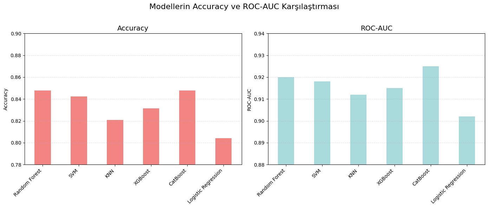

# Kalp Hastalığı Risk Tahmini – Bitirme Projesi

Bu repo, **Yapay Zeka Akademisi** bünyesinde hazırladığım bitirme projesinin Jupyter Notebook çalışmasını içerir. Çalışmanın amacı, *UCI Heart Disease* veri setini kullanarak bireylerin kalp hastalığı riski taşıyıp taşımadığını makine öğrenimi algoritmalarıyla tahmin etmek ve en yüksek doğruluk–hata dengesini sağlayan modeli belirlemektir.

---

## İçerik

| Klasör / Dosya                                       | Açıklama                        |
| --------------------------------------------------- | ------------------------------ |
| `elif_karadeniz_AI_academy_final_project.ipynb` | Projenin ana Jupyter Notebook'u |
| `final_project_summary.pdf`                 | Projenin genel özeti            |
| `requirements.txt`                                   | Gerekli Python kütüphaneleri   |

---

## Kullanılan Yöntem ve Teknolojiler

- **Python**  
- **Pandas, NumPy, Matplotlib, Seaborn** – Veri işleme & görselleştirme  
- **Scikit-learn** – Modelleme ve performans metrikleri  
- **CatBoost, XGBoost** – Gradient boosting tabanlı algoritmalar  
- **Random Forest, SVM, KNN, Logistic Regression** – Klasik makine öğrenimi modelleri  
- **Jupyter Notebook** – Deneylerin yürütülmesi  

---

## Proje Adımları

1. **Problem Tanımı & Veri Seti** – UCI Heart Disease veri setinin tanıtımı  
2. **Keşifsel Veri Analizi (EDA)** – Eksik değer analizi, görselleştirmeler, hedef değişken dönüşümü  
3. **Ön İşleme & Feature Engineering** – Eksik değer doldurma, kategorik kodlama, yeni değişken üretimi  
4. **Model Eğitimi & Değerlendirme** – 6 farklı algoritma
5. **Sonuçların Karşılaştırılması** – ROC‑AUC, Accuracy, Precision-Recall, Confusion Matrix  
6. **Modelin Pratik Kullanımı** – Yanlış negatiflerin azaltılması ve klinik senaryolara uygunluk  
7. **Sonuç & Gelecek Çalışmalar** – Model geliştirme, veri genişletme ve API entegrasyonu önerileri  

---

## Öne Çıkan Sonuçlar

| Model          | ROC‑AUC | Accuracy | Öne Çıkan Özellikler     |
| -------------- | ------- | -------- | ----------------------- |
| **CatBoost**   | 0.925   | 0.8478   | Age, cp, thalach        |
| **Random Forest** | 0.920 | 0.8478   | ca, thal, oldpeak       |
| **SVM (RBF)**  | 0.918   | 0.8424   | -                       |

> En yüksek ROC‑AUC skorunu elde eden **Random Forest** ve **CatBoost** modelleri, sadece genel doğrulukta değil; kritik yanlış negatifleri en aza indirerek sağlık alanındaki uygulamalar için güçlü adaylar olmuştur. Bu modeller, klinik karar destek sistemlerine entegre edilerek erken teşhis süreçlerine katkı sağlayabilirler.

---

## Bulgular ve Değerlendirme

### Veri Analizi Bulguları

- `ca` ve `thal` değişkenlerinde yüksek oranda eksik veri tespit edildi; uygun stratejilerle giderildi.  
- Kalp hastalığı ile en güçlü ilişkili değişkenler arasında `age`, `thalch`, `oldpeak` ve `ca` yer aldı.  
- Kategorik değişkenlerin dağılımları incelenerek hedef değişkenle olan ilişkileri ortaya kondu.

### Model Performans Değerlendirmesi

- Random Forest modeli, en düşük yanlış negatif sayısı ile (FN=12) en yüksek recall değerine ulaşarak klinik uygulamalarda en güçlü aday olmuştur.  
- CatBoost modeli ise genel doğruluk oranı (%85) ve ROC-AUC (0.92) açısından öne çıkmış, ayrıca düşük yanlış pozitif oranıyla dikkat çekmiştir.  
- KNN ve Logistic Regression gibi bazı klasik modeller, dengesiz veri dağılımı nedeniyle daha düşük performans göstermiştir.

### Klinik Uygulama Açısından

- Kalp krizi gibi hayati risk taşıyan durumlarda, yanlış negatiflerin (FN) en aza indirilmesi büyük önem taşımaktadır.

Bu nedenle tercih sıralaması şu şekildedir:

- **En iyi tercih:** Random Forest modeli; en düşük yanlış negatif oranı ve en yüksek recall değerine sahiptir.  
- **Alternatif tercih:** CatBoost modeli; Random Forest'tan sonra en düşük yanlış negatif sayısına (FN=17) sahiptir ve aynı zamanda daha az yanlış pozitif üretmektedir.

---

Proje, sağlık verileri üzerinde makine öğrenimi algoritmalarının etkili bir şekilde nasıl uygulanabileceğini göstermekte ve gerçek dünya senaryolarına entegre edilebilecek bir temel sunmaktadır.

---

## Dataset Kaggle Linki

[Dataset Kaggle Linki](https://www.kaggle.com/datasets/redwankarimsony/heart-disease-data)

